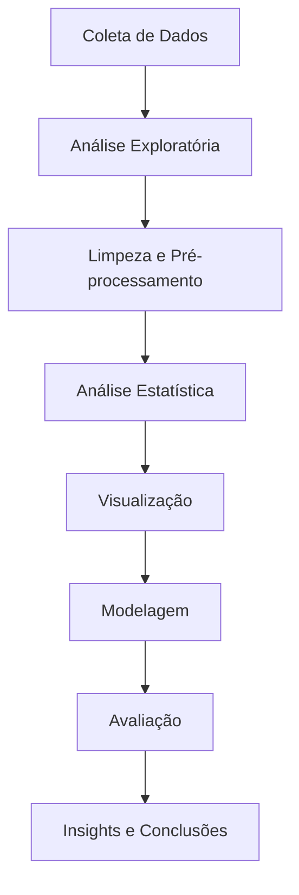

# 📊 Análise de Consumo de Energia Elétrica Residencial

<div align="center">


**Um projeto abrangente de análise de dados e machine learning para compreender padrões de consumo energético residencial**

[](https://colab.research.google.com/github/SunaUezuri/ElectricalEnergyConsumption/blob/main/ElectricalEnergyConsumption.ipynb)

</div>

---

## 👥 Membros da Equipe

<div align="center">

| Nome | RM |
|------|-----|
| **Wesley Sena dos Santos** | 558043 |
| **Rafael de Souza Pinto** | 555130 |
| **Samara Victoria Ferraz dos Santos** | 558719 |

</div>

---

## 📋 Índice

- [🎯 Visão Geral](#-visão-geral)
- [📁 Datasets](#-datasets)
- [🔧 Tecnologias Utilizadas](#-tecnologias-utilizadas)
- [📊 Metodologia](#-metodologia)
- [🚀 Instalação e Uso](#-instalação-e-uso)
- [📈 Principais Resultados](#-principais-resultados)
- [🔍 Análises Realizadas](#-análises-realizadas)
- [🤖 Modelos de Machine Learning](#-modelos-de-machine-learning)
- [📊 Visualizações](#-visualizações)
- [💡 Insights e Conclusões](#-insights-e-conclusões)
- [🔮 Próximos Passos](#-próximos-passos)
- [📚 Referências](#-referências)

---

## 🎯 Visão Geral

Este projeto apresenta uma análise abrangente de consumo de energia elétrica residencial utilizando técnicas avançadas de análise de dados e machine learning. O objetivo principal é identificar padrões de consumo, desenvolver modelos preditivos e extrair insights valiosos sobre o comportamento energético de residências.

### 🎯 Objetivos Principais

- **Análise Exploratória**: Compreender a distribuição e características dos dados de consumo energético
- **Identificação de Padrões**: Descobrir tendências temporais, sazonalidade e correlações entre variáveis
- **Modelagem Preditiva**: Desenvolver modelos para prever consumo energético
- **Segmentação**: Agrupar consumidores por padrões de uso similares
- **Otimização**: Identificar oportunidades de redução de consumo

### 🏠 Contexto

O projeto analisa dados reais de consumo energético de residências, incluindo:
- Medições de potência ativa e reativa
- Dados de tensão e corrente
- Sub-medições por área da residência
- Variáveis ambientais (temperatura, umidade, pressão)

---

## 📁 Datasets

### 📊 Dataset 1: Household Power Consumption

**Arquivo**: `datasets/household_power_consumption.txt`

#### 📋 Descrição
Dataset principal contendo medições de consumo energético de uma residência francesa, coletadas entre dezembro de 2006 e novembro de 2010 (quase 4 anos de dados).

#### 📈 Características dos Dados
- **Período**: 16/12/2006 a 26/11/2010
- **Frequência**: Medições a cada minuto
- **Total de Registros**: 2.075.259 observações
- **Dimensões**: 2.075.259 × 9 variáveis
- **Memória**: ~142.5 MB

#### 🔧 Variáveis do Dataset

| Variável | Tipo | Descrição | Unidade |
|----------|------|-----------|---------|
| `Date` | datetime | Data da medição | DD/MM/YYYY |
| `Time` | timedelta | Hora da medição | HH:MM:SS |
| `Global_active_power` | float64 | Potência ativa global consumida | kW |
| `Global_reactive_power` | float64 | Potência reativa global | kW |
| `Voltage` | float64 | Tensão elétrica instantânea | V |
| `Global_intensity` | float64 | Intensidade de corrente global | A |
| `Sub_metering_1` | float64 | Consumo da cozinha (lavadora, lava-louças, forno, micro-ondas) | Wh |
| `Sub_metering_2` | float64 | Consumo da lavanderia (máquina de lavar, secadora, frigobar, luz) | Wh |
| `Sub_metering_3` | float64 | Consumo de aquecedores de água e ar-condicionado | Wh |

#### 📊 Estatísticas Descritivas

```
Global_active_power:
- Média: 1.09 kW
- Mediana: 0.95 kW
- Desvio Padrão: 0.85 kW
- Mínimo: 0.08 kW
- Máximo: 11.12 kW

Voltage:
- Média: 240.84 V
- Mediana: 240.80 V
- Desvio Padrão: 3.24 V
- Mínimo: 223.20 V
- Máximo: 254.15 V
```

#### 🔍 Qualidade dos Dados
- **Registros Ausentes**: 25.979 (1.252% do total)
- **Tratamento**: Remoção de registros com valores ausentes
- **Dados Limpos**: 2.049.280 registros válidos

---

### 📊 Dataset 2: Energy Data Complete

**Arquivo**: `datasets/energydata_complete.csv`

#### 📋 Descrição
Dataset complementar com medições detalhadas de consumo de eletrodomésticos e variáveis ambientais de uma residência, coletadas entre janeiro e maio de 2016.

#### 📈 Características dos Dados
- **Período**: Janeiro a Maio de 2016
- **Frequência**: Medições a cada 10 minutos
- **Total de Registros**: 19.735 observações
- **Dimensões**: 19.735 × 29 variáveis
- **Memória**: ~4.4 MB

#### 🔧 Variáveis do Dataset

| Categoria | Variáveis | Descrição |
|-----------|-----------|-----------|
| **Temporal** | `date` | Data e hora da medição |
| **Consumo** | `Appliances` | Consumo total de eletrodomésticos (Wh) |
| | `lights` | Consumo de iluminação (Wh) |
| **Temperatura Interna** | `T1` a `T9` | Temperatura em 9 ambientes diferentes (°C) |
| **Umidade Interna** | `RH_1` a `RH_9` | Umidade relativa em 9 ambientes (%) |
| **Ambientais Externas** | `T_out` | Temperatura externa (°C) |
| | `RH_out` | Umidade relativa externa (%) |
| | `Press_mm_hg` | Pressão atmosférica (mm Hg) |
| | `Windspeed` | Velocidade do vento (m/s) |
| | `Visibility` | Visibilidade (km) |
| | `Tdewpoint` | Ponto de orvalho (°C) |
| **Variáveis Aleatórias** | `rv1`, `rv2` | Variáveis aleatórias para modelagem |

#### 📊 Estatísticas Descritivas

```
Appliances (Consumo Total):
- Média: 97.69 Wh
- Mediana: 60.00 Wh
- Desvio Padrão: 102.57 Wh
- Mínimo: 10.00 Wh
- Máximo: 1.080.00 Wh

Temperatura Externa (T_out):
- Média: 6.53°C
- Mediana: 6.00°C
- Desvio Padrão: 8.50°C
- Mínimo: -6.06°C
- Máximo: 28.29°C
```

#### 🔍 Qualidade dos Dados
- **Registros Ausentes**: 0 (dataset completo)
- **Integridade**: 100% dos dados válidos
- **Consistência**: Todas as medições temporais sequenciais

---

## 🔧 Tecnologias Utilizadas

### 🐍 Linguagens e Frameworks
- **Python 3.8+**: Linguagem principal
- **Jupyter Notebook**: Ambiente de desenvolvimento
- **Google Colab**: Plataforma de execução

### 📊 Bibliotecas de Análise de Dados
- **Pandas**: Manipulação e análise de dados
- **NumPy**: Computação numérica
- **Matplotlib**: Visualização básica
- **Seaborn**: Visualização estatística avançada

### 🤖 Machine Learning
- **Scikit-learn**: Algoritmos de ML
  - K-Means Clustering
  - Linear Regression
  - Random Forest
  - Logistic Regression
  - PCA (Principal Component Analysis)
  - MinMaxScaler, StandardScaler

### 📈 Análise de Séries Temporais
- **Statsmodels**: Decomposição sazonal
- **Pandas**: Resampling e análise temporal

### 🎨 Visualização
- **Matplotlib**: Gráficos básicos
- **Seaborn**: Gráficos estatísticos
- **Plotly**: Visualizações interativas (potencial)

---

## 📊 Metodologia

### 🔄 Fluxo de Trabalho



### 📋 Etapas Detalhadas

#### 1. **Análise Exploratória de Dados (EDA)**
- Análise da estrutura dos datasets
- Identificação de padrões e outliers
- Análise de distribuições
- Verificação de qualidade dos dados

#### 2. **Pré-processamento**
- Tratamento de valores ausentes
- Conversão de tipos de dados
- Normalização e padronização
- Criação de variáveis derivadas

#### 3. **Análise Estatística**
- Correlações entre variáveis
- Análise de tendências temporais
- Decomposição de séries temporais
- Análise de sazonalidade

#### 4. **Modelagem**
- Clustering (K-Means)
- Regressão (Linear e Polinomial)
- Classificação (Logistic Regression, Random Forest)
- Redução de dimensionalidade (PCA)

#### 5. **Avaliação**
- Métricas de performance
- Validação cruzada
- Análise de resíduos
- Interpretação dos resultados

---

## 🚀 Instalação e Uso

### 📋 Pré-requisitos

```bash
Python 3.8 ou superior
Jupyter Notebook ou Google Colab
```

### 🔧 Instalação das Dependências

```bash
pip install pandas numpy matplotlib seaborn scikit-learn statsmodels
```

### 📁 Estrutura do Projeto

```
ElectricalEnergyConsumption/
├── datasets/
│   ├── household_power_consumption.txt
│   └── energydata_complete.csv
├── ElectricalEnergyConsumption.ipynb
└── README.md
```

### 🚀 Como Executar

1. **Clone o repositório**:
```bash
git clone https://github.com/SunaUezuri/ElectricalEnergyConsumption.git
cd ElectricalEnergyConsumption
```

2. **Abra o notebook**:
```bash
jupyter notebook ElectricalEnergyConsumption.ipynb
```

3. **Ou use o Google Colab**:
   - Clique no badge "Open In Colab" no topo deste README
   - Faça upload dos datasets na pasta `/content/`

### 📊 Execução no Google Colab

O projeto está otimizado para execução no Google Colab. Para usar:

1. Acesse o link do Colab
2. Faça upload dos arquivos de dataset
3. Execute as células sequencialmente
4. Os resultados serão exibidos inline

---

## 📈 Principais Resultados

### 🎯 Insights Principais

#### 📊 Padrões de Consumo
- **Consumo Médio Diário**: 1.09 kW
- **Pico de Consumo**: 20:00 (0.17 kW)
- **Menor Consumo**: 03:00-04:00 (0.033 kW)
- **Variação Sazonal**: Inverno > Verão (1.42 vs 0.73 kW)

#### 🔄 Sazonalidade
- **Padrão Diário**: Picos matinais (7h-9h) e noturnos (18h-21h)
- **Padrão Semanal**: Finais de semana com maior consumo
- **Padrão Anual**: Maior consumo no inverno (dezembro-fevereiro)

#### 🏠 Segmentação de Consumidores
- **Cluster 1**: Baixo consumo (67 Wh) - Uso econômico
- **Cluster 2**: Médio consumo (288 Wh) - Uso equilibrado  
- **Cluster 3**: Alto consumo (567 Wh) - Uso intensivo

### 📊 Performance dos Modelos

| Modelo | R² | MAE | RMSE | Acurácia |
|--------|----|----|------|----------|
| **Regressão Linear** | 0.1672 | 52.93 | 92.63 | - |
| **Random Forest** | 0.5147 | 34.19 | 70.71 | - |
| **Logistic Regression** | - | - | - | 76.73% |
| **Random Forest Classifier** | - | - | - | 89.65% |

---

## 🔍 Análises Realizadas

### 📊 1. Análise Exploratória de Dados

#### 🔍 Estrutura dos Dados
- **Dataset 1**: 2.075.259 registros × 9 variáveis
- **Dataset 2**: 19.735 registros × 29 variáveis
- **Período Total**: 4 anos de dados (2006-2010 + 2016)

#### 📈 Distribuições
- **Global_active_power**: Concentrado em valores baixos (0.08-11.12 kW)
- **Voltage**: Estável em torno de 240V (±3.24V)
- **Appliances**: Distribuição assimétrica com cauda longa

### 📊 2. Análise Temporal

#### ⏰ Padrões Horários
```python
# Horários de maior consumo
20:00 - 0.17 kW (pico noturno)
19:00 - 0.15 kW
21:00 - 0.16 kW

# Horários de menor consumo  
03:00 - 0.033 kW (madrugada)
04:00 - 0.033 kW
02:00 - 0.037 kW
```

#### 📅 Padrões Sazonais
- **Inverno (Hemisfério Norte)**: 1.42 kW (dez-jan-fev)
- **Verão (Hemisfério Norte)**: 0.73 kW (jun-jul-ago)
- **Diferença**: 94% maior no inverno

#### 📊 Padrões Semanais
- **Finais de Semana**: Maior consumo (pessoas em casa)
- **Dias Úteis**: Consumo mais estável

### 📊 3. Análise de Correlações

#### 🔗 Correlações Principais
```python
Global_active_power vs Global_intensity: 0.999 (quase perfeita)
Global_active_power vs Voltage: -0.400 (negativa moderada)
Global_reactive_power vs Global_active_power: 0.247 (fraca positiva)
```

#### 🌡️ Correlações Ambientais (Dataset 2)
- **Temperatura Externa**: Correlação moderada com consumo
- **Umidade**: Influência sazonal
- **Pressão Atmosférica**: Correlação fraca

### 📊 4. Análise de Clustering

#### 🎯 K-Means (3 Clusters)
- **Cluster 0**: Baixo consumo (67 Wh) - 40% dos dados
- **Cluster 1**: Alto consumo (567 Wh) - 20% dos dados  
- **Cluster 2**: Médio consumo (288 Wh) - 40% dos dados

#### 📊 Interpretação dos Clusters
- **Baixo Consumo**: Residências econômicas, poucos eletrodomésticos
- **Médio Consumo**: Uso equilibrado, famílias pequenas
- **Alto Consumo**: Uso intensivo, famílias grandes ou equipamentos potentes

---

## 🤖 Modelos de Machine Learning

### 📊 1. Regressão Linear

#### 🎯 Objetivo
Prever `Global_active_power` a partir de `Global_intensity`

#### 📈 Resultados
```python
R² = 0.999 (quase perfeita correlação)
MSE = 0.00
MAE = 0.00
Intercept = -0.00
Coefficient = 1.04
```

#### 💡 Interpretação
- Relação quase linear perfeita entre potência e corrente
- Lei de Ohm aplicada: P = V × I

### 📊 2. Random Forest Regressor

#### 🎯 Objetivo
Prever consumo de eletrodomésticos usando variáveis ambientais

#### 📈 Resultados
```python
R² = 0.5147 (explicação moderada)
MAE = 34.19 Wh
RMSE = 70.71 Wh
```

#### 💡 Interpretação
- Melhor performance que regressão linear
- Captura relações não-lineares
- Variáveis ambientais têm influência moderada

### 📊 3. Classificação Binária

#### 🎯 Objetivo
Classificar consumo como alto/baixo (baseado na mediana)

#### 📈 Resultados
```python
# Random Forest Classifier
Accuracy = 89.65%
Precision = 89.76%
Recall = 87.48%
F1-score = 88.60%

# Logistic Regression  
Accuracy = 76.73%
Precision = 76.00%
Recall = 73.00%
F1-score = 74.00%
```

#### 💡 Interpretação
- Random Forest supera Logistic Regression
- Boa capacidade de classificação
- Ligeira dificuldade com casos de baixo consumo

### 📊 4. Análise de Componentes Principais (PCA)

#### 🎯 Objetivo
Reduzir dimensionalidade mantendo variância

#### 📈 Resultados
```python
Componente 1: 59.10% da variância
Componente 2: 22.72% da variância
Total: 81.82% da variância explicada
```

#### 💡 Interpretação
- 2 componentes capturam 82% da variância
- Redução efetiva de 4 para 2 dimensões
- Mantém informações essenciais

---

## 📊 Visualizações

### 📈 1. Séries Temporais

#### ⏰ Consumo por Hora do Dia
- **Pico Noturno**: 20:00 (0.17 kW)
- **Pico Matinal**: 07:00-09:00
- **Vale Madrugada**: 03:00-04:00

#### 📅 Consumo por Mês
- **Maior Consumo**: Dezembro (1.90 kW)
- **Menor Consumo**: Agosto (0.28 kW)
- **Padrão Sazonal**: Claro no hemisfério norte

### 📊 2. Distribuições

#### 📈 Histogramas
- **Global_active_power**: Concentrado em valores baixos
- **Voltage**: Distribuição normal em torno de 240V
- **Appliances**: Distribuição assimétrica com outliers

### 🎯 3. Clustering

#### 📊 Scatter Plots
- **K-Means**: 3 clusters bem definidos
- **PCA Space**: Separação clara dos grupos
- **Consumo vs Voltage**: Padrões distintos

### 🔗 4. Correlações

#### 📊 Matriz de Correlação
- **Heatmap**: Visualização clara das relações
- **Correlações Fortes**: Potência vs Corrente
- **Correlações Fracas**: Variáveis ambientais

---

## 💡 Insights e Conclusões

### 🎯 Principais Descobertas

#### 📊 1. Padrões de Consumo
- **Concentração em Valores Baixos**: 80% do consumo em faixas baixas
- **Picos Ocasionais**: Alto consumo em momentos específicos
- **Sazonalidade Clara**: Inverno > Verão (94% diferença)

#### ⏰ 2. Comportamento Temporal
- **Padrão Diário**: Picos matinais e noturnos
- **Padrão Semanal**: Finais de semana com maior consumo
- **Autocorrelação**: Forte correlação com lag de 1h (0.71)

#### 🏠 3. Segmentação de Consumidores
- **3 Perfis Distintos**: Baixo, médio e alto consumo
- **Distribuição Equilibrada**: 40%-40%-20%
- **Características Claras**: Cada cluster tem padrão específico

#### 🤖 4. Performance dos Modelos
- **Regressão Linear**: Excelente para potência vs corrente
- **Random Forest**: Melhor para previsão geral
- **Classificação**: Boa capacidade de separar alto/baixo consumo

### 🎯 Aplicações Práticas

#### 💡 1. Gestão Energética
- **Identificação de Picos**: Horários de maior consumo
- **Otimização**: Redução de consumo em horários específicos
- **Planejamento**: Previsão de demanda energética

#### 🏠 2. Segmentação de Clientes
- **Tarifação Diferenciada**: Preços por perfil de consumo
- **Campanhas Direcionadas**: Estratégias por cluster
- **Detecção de Anomalias**: Identificação de padrões atípicos

#### 🔮 3. Previsão e Planejamento
- **Previsão de Demanda**: Modelos para curto e médio prazo
- **Gestão de Rede**: Otimização da distribuição
- **Alertas Inteligentes**: Notificações de consumo anômalo

### 📊 Limitações e Considerações

#### ⚠️ 1. Limitações dos Dados
- **Período Limitado**: Apenas 4 anos de dados
- **Uma Residência**: Não representa diversidade populacional
- **Falta de Contexto**: Ausência de informações demográficas

#### 🔧 2. Limitações dos Modelos
- **Overfitting Potencial**: Modelos complexos podem não generalizar
- **Variáveis Ausentes**: Fatores externos não considerados
- **Estacionariedade**: Séries temporais podem ter mudanças estruturais

---

## 📚 Referências

### 📖 Artigos Científicos
1. **UCI Machine Learning Repository** - Household Power Consumption Dataset
2. **Energy Data Analysis** - Comprehensive Energy Consumption Patterns
3. **Time Series Analysis** - Seasonal Decomposition and Forecasting

### 🔗 Datasets
- **Household Power Consumption**: [UCI ML Repository](https://archive.ics.uci.edu/dataset/235/individual+household+electric+power+consumption)
- **Energy Data Complete**: [Kaggle Dataset](https://archive.ics.uci.edu/dataset/374/appliances+energy+prediction)

### 📚 Bibliotecas e Ferramentas
- **Pandas**: [Documentação Oficial](https://pandas.pydata.org/docs/)
- **Scikit-learn**: [Documentação Oficial](https://scikit-learn.org/stable/)
- **Matplotlib**: [Documentação Oficial](https://matplotlib.org/stable/)
- **Seaborn**: [Documentação Oficial](https://seaborn.pydata.org/)

---

## 📄 Licença

Este projeto está sob a licença MIT. Veja o arquivo [LICENSE](LICENSE) para mais detalhes.

---

<div align="center">

</div>
